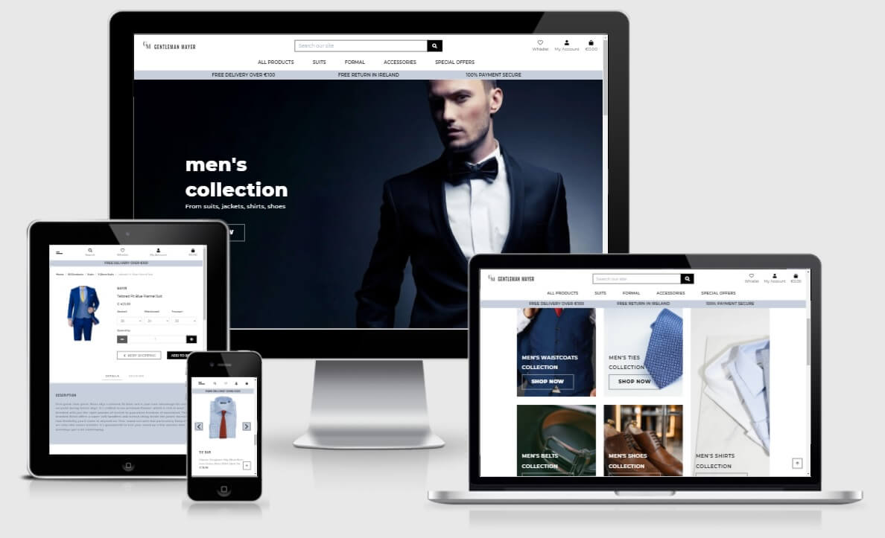
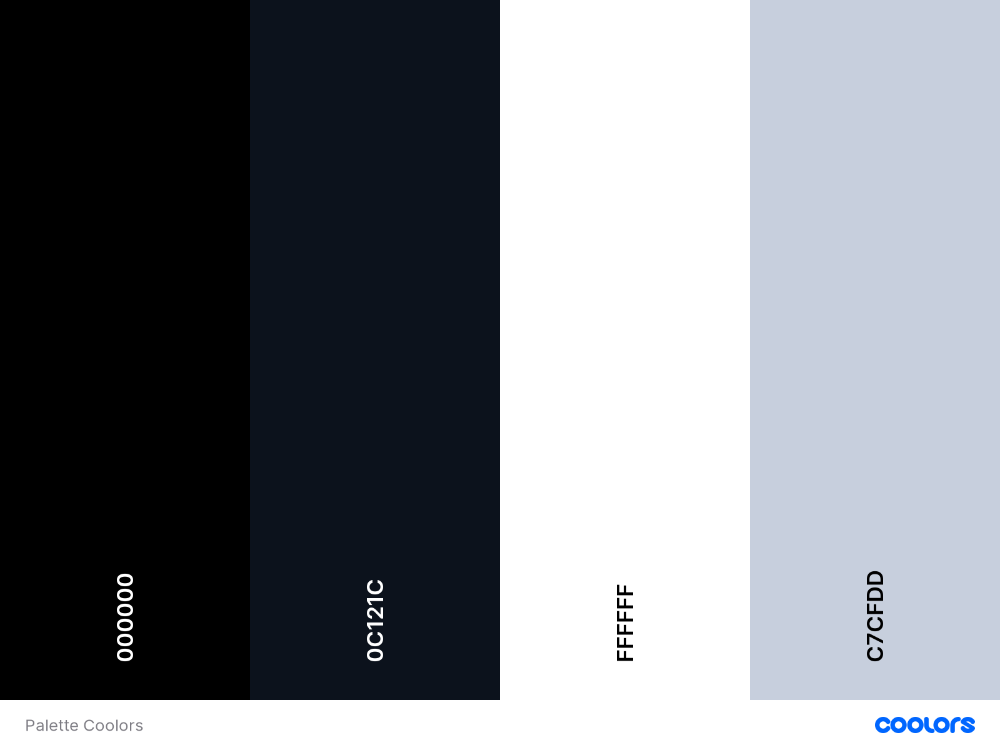
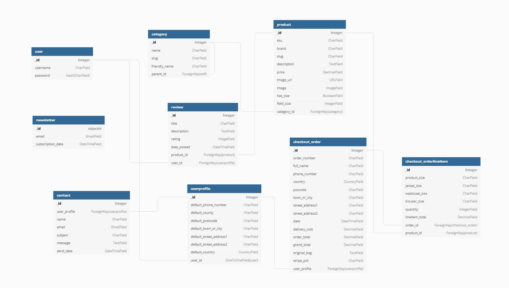
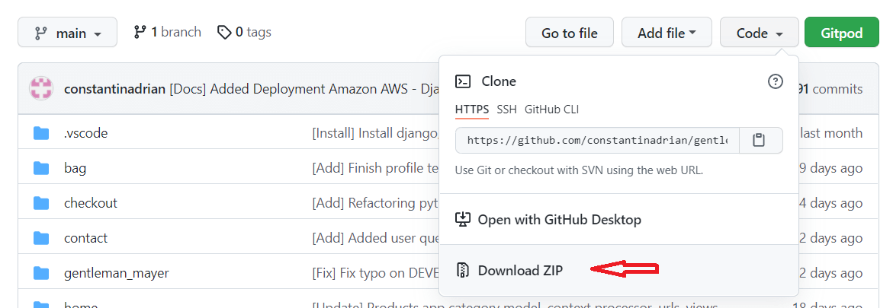

# Gentleman Mayer



Gentleman Mayer an e-commerce site offer suits, tuxedo, and all other men's accessories. The website is focused on high-quality products to maintain customer satisfaction and loyalty and reduce the risk and cost of the replacement of a faulty product.

[View live project here](https://gentleman-mayer.herokuapp.com/)

## Table of Contents

1. [UX](#ux)

    - [User stories](#user-stories)

    - [Strategy](#strategy)

    - [Scope](#scope)

    - [Structure](#structure)

    - [Skeleton](#skeleton)

    - [Surface](#surface) 

2. [Technologies Used](#technologies-used)

3. [Testing](#testing)

4. [Deployment](#deployment)

    - [Heroku](#heroku)

    - [Local Clone](#local-clone)

5. [Credit](#credit)

6. [Disclaimer](#disclaimer)

[Back to Top](#table-of-contents)

-----

- ### UX:

  - #### User stories

    I.	First Time Visitor Goals:

    - To be able to quickly understand the purpose of the website. 

    - To be able to quickly identify new products and sales.

    - To be able to know if there is a free delivery

    - To be able to know if there is a free return

    - To be able to view a specific category of products and use filters inside that category.

    - To be able to view product details and reviews from other customers.

    - To be able to adjust the product quantity from shopping bag

    - To be able to remove a product from a shopping bag

    - To be able to receive confirmation after purchase a product.

    - To be able to contact the company and subscribe to the newsletter to receive the latest offers

    II.	Returning User Goals:

    - To be able to register for an account and receive confirmations after.

    - To be able to easily login, logout and easily recover my password

    - To have a user profile where I keep track of my orders, my query and update personal information

    - To be able to create a wishlist so I can review it later

    - To be able to leave review for specific product, and be able to edit or delete the review

    III.	Site Owner Goals:

    - To be able to add, edit and delete products

    - To be able to add, edit and delete categories.

    - Be able to have access to the admin section

    - Have a secure online payment

    - Send confirmation order for each purchase with order and customer details

 - #### Strategy

    - The website was built for those users who want to have a business professional look. The website is designed with search functionality that allows users to search products from different category and with different keywords. In order to attract more users and keep them on the website, a variety of large products and accessories have been made available for them. The purpose of all functionality it's for the owner of the website to promote his brand of products as well.

    | Opportunity                                 | Importance | Viability / Feasibility |
    | :------------------------------------------ | :--------: | :---------------------: |
    | Home Page                                   |     5      |            5            |
    | Product Page - Search By Keywords           |     5      |            5            |
    | Product detail                              |     5      |            5            |
    | Register Page                               |     4      |            5            |
    | Login Page                                  |     4      |            5            |
    | Product Management                          |     5      |            5            |
    | Reviews Page                                |     5      |            4            |
    | Contact/Newsletter Page                     |     5      |            4            |
    | Profile Page                                |     5      |            4            |
    | Wishlist Page                               |     5      |            4            |
    | Review Page                                 |     5      |            4            |


[Back to Top](#table-of-contents)

-----
    
 - #### Scope

    Based on the strategy table all the features were implemented in order to achieve user and owner goals

    - Home page - to quickly understand the purpose of the website

    - Product Page - where users can view all products and the owner can promote his products along with other brands

    - Product detail - where the user can find information about the product

    - Register Page - where user can create an account on the website

    - Login Page - where user can log in to his profile

    - Product Management - where the admin can Add / Edit / Delete Product

    - Reviews Page - Where users can read reviews about different products

    - Contact/Newsletter - Contact the business owner and get the latest offers

    - Profile Page - Have a profile page where users can save their details

    - Wishlist Page -Where users can save the products that they would want to buy

    - Review Page -Where users can see all the reviews from all products

[Back to Top](#table-of-contents)

-----
    
  - #### Structure

    - ##### Features: 

        Responsive on all screen devices.

      - ##### Existing Features:
    
        1. Home App

            - The logo of Gentleman Mayer

            - Navigation bar - to help users navigate between each category 
          
            - Search form - Where the user can search by keyword

            - Landing section 
          
              - with the hero image and welcome text that will make the users quickly understand the purpose of the website

              - call to action shop now button

            - Collection section - Where the user can find different cards to go to a specific collection of products

            - New arrival Carousell - Where the user can see the new arrival collection

            - Sale - Where users can find the latest offers

        2. Products App

            - Category fields - Where users can navigate to each category

            - Sort field - Where user can sort the products by category, name, price, and brand

            - All products that we currently have on the website (12 products on each page)

            - If the user is login there is a call to action icon for add/remove to wishlist

        3. Product details

            - Where the user can see the details of each product along with the review from other users (if any)

            - Call to action button to keep shopping or add to bag

            - If the user is login there is another call to action button for add/remove to wishlist

            - Add / Edit / Delete review functionality for loggin users
          
            - Depending on what category the product is, along with the page there is two or one carousels with suggested products to complete the look

        4. Register

            - Where the user can create an account and a confirmation email is send to the email address used when register.

        5. Login Page

            - Where the user can log in to their account

        6. Profile App

            - Where the user can update their details 

            - Where the user can check their order history
          
            - Where the user can see their query history send to the owner thru the contact form

        7. Bag App

            - Where the user can see their products that they added in the bag

            - Here they can update their products before going to secure checkout

            - Here they can remove on products before going to secure checkout

            - And also theu a button to Keep Shopping

        8. Checkout App

            - Where the user can complete the order by filling the name, email, delivery details and credit card details

            - Here they can also see an order summary on they shopping

        9. Wishlist App

            - Where the user can view all the products that they have on their wishlist

            - From here the user can go to view each product from the wishlist

            - Remove the product from the wishlist

        10. Review App

            - Where the user can view all the reviews from all products and they can navigate to a specific product after words to see the product detail

            - Can sort the reviews from rating or product name

            - If the user is logged and has left some previous reviews he can edit/delete their his reviews

        11. Contact App

            - Where the user can contact the owner for different queries

            - The register user will have an history with all the queries that they send. 

        12 Newsletter App

            - Where the user for now they can subscribe

        13. Footer section

            - Where the users can find the newsletter subscription form

            - Where the users can find informative links like Contact page and Review about our products
            
            - Where the users can find links to the business social media pages
 
      - ##### Future Features to Implement:

        - On the Contact App the query history initialy suppose to be like a small private chat between the user and admin, where the admin can replay to the message that he receive and automaticly an email with the response and also a replay will be send to the user history query. But in the interest of time this is now on the future features to implement.

        - Create a Blog Where the user can read about the newest fashion in Men Collection, and also where they can comment

        - To add variants to each product so that the user can see on the product detail page different colors for each product, the sizes that come with each color, and different prices if the prices vary for each color

        - Finish the Newsletter app to send and to send to all subscriptions email with the new arrival and special offers that Gentleman Mayer has

        - Also have a page for unsubscribe.

        - Add coupons for discount, this can also be sent with the newsletter email

        - Create social media links to share the product from the product detail page

        - Register with social media account

[Back to Top](#table-of-contents)

-----

- #### Skeleton

    -  [Phone Wireframes](readme_file/wireframes/phone.pdf)

    -  [Tablet Wireframes](readme_file/wireframes/tablet.pdf)

    -  [Desktop Wireframes](readme_file/wireframes/desktop.pdf)

[Back to Top](#table-of-contents)

-----

- #### Surface

    -  ##### Colour Scheme

        - Palette:

            - The colors from palette colors were selected to match the Hero image background from the Home page

            

    -  ##### Typography

        - For this project, I choose three types of Google Fonts: 'Montserrat', 'Oswald' and 'Raleway'.
       
            For the consistency:

                - 'Montserrat' fonts were used for the header, subheader, links, and all other paragraphs within the page.

                - 'Oswald' fonts were used for the section titles and brand names

                - 'Raleway' fonts were used for the product description and reviews

    -  ##### Imagery

        - Because imagery is important I have carefully chosen the background hero image on the landing page, so can easily reflect the website purpose right from the start

[Back to Top](#table-of-contents)

-----

- ### Technologies Used

  - #### Languages:

    - [HTML5](https://en.wikipedia.org/wiki/HTML5) - used to structure website and its content.

    - [CSS3](https://en.wikipedia.org/wiki/CSS) - to format the contents of each webpage.

    - [JS](https://en.wikipedia.org/wiki/JavaScript) - for DOM manipulation.

    - [Pyhton3](https://www.python.org/) – to add functionalities to the server-side

  - #### Frameworks, Libraries & Programs:

    - [Bootstrap](https://getbootstrap.com/) – CSS framework used to help with the navbar, contact form, cards, and other classes that were used to make the app responsive.

    - [Google Fonts](https://fonts.google.com/) - to import the font-family used in the website.

    - [Font Awesome](https://fontawesome.com/) - icons are a visual way to help add meaning to elements.

    - [GitHub](https://github.com/) - used to create and host the repository

    - [Git](https://git-scm.com/) - used for the version-control system for tracking changes in any set of files

    - [Gitpod](https://gitpod.io/) - IDE used to develop the project 

    - [Django](https://www.djangoproject.com/) – Python web framework

    - [SQLite3](https://jinja.palletsprojects.com/en/2.11.x/) – Database used by default by Django, used in development

    - [Django Crispy Forms](https://django-crispy-forms.readthedocs.io/en/latest/) used to style the forms on the website

    - [Django Allauth](https://django-allauth.readthedocs.io/en/latest/installation.html) used for authentification on the site

    - [PIP](https://pypi.org/project/pip/) for installation of tools needed in this project.

    - [Heroku](https://www.heroku.com/) - cloud platform for hosting the website

    - [PostgreSQL](https://www.postgresql.org/) - database used by the heroku hosting platform

    - [Amazon Web Services](https://aws.amazon.com/) - cloud computing platforms that host the static and media files

    - [Stripe](https://stripe.com/en-ie) - financial services used to handle payment on the site

    - [JQuery](https://jquery.com/) - to provide additionally functionality for the site


  - #### Additional tools:

    - [VS Code](https://code.visualstudio.com/) - IDE

    - [Autoprefixer CSS](https://autoprefixer.github.io/) - used to add prefix to css code

    - [Tinypng](https://tinypng.com/) - used to compress all image files in order to reduce loading time on each page

    - [HTML Validator](https://validator.w3.org/) - used to check HTML code for error

    - [CSS Validator](https://jigsaw.w3.org/css-validator/) - used to check CSS code for error

    - [JSHint](https://jshint.com/) - used to check JS code for error

    - [PEP8 Validator](http://pep8online.com/) - was used to validate Python

    - [I Am Responsive](http://ami.responsivedesign.is/) - for the main image in Readme to show responsive to different screen size

    - [Balsamiq](https://balsamiq.com/) - used to make the wireframes for the project

    - [Coolors](https://coolors.co/) - used for color palette

    - [Adobe Photoshop 2020](https://www.adobe.com/ie/products/photoshop.html?gclid=Cj0KCQjwrsGCBhD1ARIsALILBYpcZ9gNDfvVo1tJUaPzX_D5Bbo7kr6tDseIjZmjRTGbiBTqIURjULAaAvGnEALw_wcB&mv=search&sdid=LZ32SYVR&ef_id=Cj0KCQjwrsGCBhD1ARIsALILBYpcZ9gNDfvVo1tJUaPzX_D5Bbo7kr6tDseIjZmjRTGbiBTqIURjULAaAvGnEALw_wcB:G:s&s_kwcid=AL!3085!3!441664403997!b!!g!!%2Bphotoshop!1423510553!55397634865) - used to create logo, favicon for this project and to edit all the photos from this project.

[Back to Top](#table-of-contents)

-----

- ### Information Architechture:

    - Database Diagram:

        - Database Diagram was created with [dbdiagram.io](https://dbdiagram.io/d)

        

[Back to Top](#table-of-contents)

-----

- ### Testing

    - Testing documentation can be found [HERE](TESTING.md)

 [Back to Top](#table-of-contents)

-----

- ### Deployment

  - #### Heroku

    - The project was deployed to Heroku using the following steps:

        1. In order to deploy to Heroku you need an [account](https://signup.heroku.com/login?redirect-url=https%3A%2F%2Fid.heroku.com%2Foauth%2Fauthorize%3Fclient_id%3Dd2ef2b24-e72c-4adf-8506-28db2218547d%26response_type%3Dcode%26scope%3Dglobal%252Cplatform%26state%3DSFMyNTY.g2gDbQAAADFodHRwczovL2Rhc2hib2FyZC5oZXJva3UuY29tL2F1dGgvaGVyb2t1L2NhbGxiYWNrbgYAnwF4L3kBYgABUYA.q2PQc0k53ICJ0LR6VFKbOkyuEqmEtG0iuVzTM38UNAI)

        2. Now you can create a new app from the dashboard ``` New``` Menu
        

        3. Now you need to set up a name and select a region closest to you

            NOTE: Remember the name has to be unique and generally use a dash and lowercase letters

        4. On the ```Resources``` tab we gonna provision a new Postgres Database that will go used for this project:

            a. On the ```Add-ons``` search for Heroku Postgres and click on it

            b. On the pop-up window select the free plan ```Hobby Dev - Free``` and click ```Submit Order Form```

        5. To use Heroku Postgres go back to the project install the two dependencies:

            ```
              pip3 install dj_database_url
              pip3 install psycopg2-binary
            ```

        6. On your project create ```requirements.txt``` file that contains a list of our Python dependencies by typing in the terminal 
        
            ```
            pip3 freeze --local > requirements.txt
            ```

        7. Now on your ```settings.py``` file  ```import dj_database_url``` and in the database settings comment out the current DATABASES settings and replace the default DATABASES with the following settings:

            ```
            DATABASES = {
                'default': dj_database_url.parse('DATABASE_URL')
            }
            ```

            NOTE: The ```DATABASE_URL``` we can get from Heroku, an app that you just created, under the ```Settings``` tab on ```Reveal Config Vars```

        8. Since now we are connected to Heroku Postgres we need to run migrations again, and we can see that with:


            ```
            python3 manage.py showmigrations
            ```

              NOTE: At this stage, you might get an error 
            
            ```
            django.db.utils.OperationalError: FATAL:  role "" does not exist on heroku postgres
            ```

              since in the Full Template, from Code Institute, there is a PGHOSTADDR local variable that has been added to accommodate for the new SQLAlchemy lessons. In order to run showmigrations and migrate after we need to run the terminal this command:

            ```
            unset PGHOSTADDR
            ```

            and after run again to see that none of the migrations are marked off:

            ```
            python3 manage.py showmigrations
            ```

        9. Now run the following command to apply all the migrations and get our Heroku Postgres database set up:

            ```
            python3 manage.py migrate
            ```

        10. Now we can use our fixture again by loading the categories:

            ```
            python3 manage.py loaddata categories
            ```

        11. Following by loading the products:

            ```
            python3 manage.py loaddata products
            ```

            IMPORTANT NOTE: We need to load data in this order because the products depend on the categories already existing

        12. Now we can create a superuser so we can log in with

            ```
            python3 manage.py createsuperuser
            ```

        13. Since our database in Heroku is all set up, we gonna have an if statement in ```setting.py``` to set the ```DATABASES```
        so when we run on Heroku we are gone use the environment variable ```DATABASE_URL``` to connect to Postgres else we gonna connect for SQLite

            NOTE: That at I remain the ```DATABASE_URL``` variable to ```MAYER_DATABASE_URL``` near the end of the project. Check settings.py

            ```
            if 'MAYER_DATABASE_URL' in os.environ:
                DATABASES = {
                    'default': dj_database_url.parse(os.environ.get('MAYER_DATABASE_URL'))
                }
            else:
                DATABASES = {
                    'default': {
                        'ENGINE': 'django.db.backends.sqlite3',
                        'NAME': BASE_DIR / 'db.sqlite3',
                    }
                }
            ```

        14. In order for the deployment to work we need to install another package qunicorn, which will act as our web server:


            ```
            pip3 install gunicorn
            ```

        15. Now we need to freeze that package in our requirements file:
        
            ```
            pip3 freeze --local > requirements.txt
            ```

        16. Create ```Procfile``` file that tells Heroku to create a web Dyno which will run gunicorn and serv our Django app
            ```
            echo web: gunicorn <app-name>.wsgi:application > Procfile
            ```

        17. Now we need to connect to Heroku from the terminal: 
            ```
            heroku login -i
            ```
        18. Temporarily disable COLLECTSTATIC, because we don't want our static file when we deploy, since we are gone use AWS for that
            ```
            heroku config:set DISABLE_COLLECTSTATIC=1 --app <app-name>
            ```
        19. Now we need to add the hostname of our Heroku app to allowed hosts in ```setting.py```

            ```
            ALLOWED_HOSTS = ['<app-name>.herokuapp.com', 'localhost']
            ```


        20. Now add a variable into Heroku app, settings under Reveal Config Vars:

            | Key                            |    Value                    |
            | :----------------------------- | :-------------------------: |
            | HOST_EMAIL_PASS                |  < Gmail app password >     |
            | HOST_EMAIL_USER                |  < Gmail email address >    |
            | MAYER_SECRET_KEY               |  < Django Secret key >      |
            | MAYER_STRIPE_PUBLIC_KEY        |  < Stripe Public key >      |
            | MAYER_STRIPE_SECRET_KEY        |  < Stripe Secret key >      |
            | MAYER_STRIPE_WH_SECRET         |  < Stripe Webhook key >     |


        21. Now we can push to GitHub with:

            ```
            git add .

            git commit -m "[Heroku] Deploy to Heroku"

            git push
            ```      

        22. And to finally push to Heroku:

            ```
            heroku git:remote -a <heroku app-name>
            git push heroku master
            ```

            NOTE: We needed to initialize our Heroku git remote because we created our app on the website 

    - Set up the app for automatically deployed for when we push to GitHub:

        1. Go to your app in Heroku

        2. On the ```Deploy``` tab and on each section: 
        
            a. ``` Deployment method``` - set it to Connect to Github

            b. ```Connect to Github``` - search for your repository and click connect

            c. ```Automatic deploys``` - Enable Automatic Deploys
      
  - #### Amazon AWS

    - For this project, Amazon AWS was used to store static and media files.

        1. Create an account to [Amazon AWS](https://portal.aws.amazon.com/billing/signup#/start)
 
            a. Fill in the email, password and choose a username for the account and select ```Continue```
            
            b. Choose the ```Account type``` Personal and fill in the requirements information and select ```Create Account and Continue```

            c. Fill in the Credit card details which will be used for billing in case you go above the free usage limits, but you won't go anywhere near them with this project

            NOTE: Amazon AWS is not a free service if you go above the free usage limits

        2. Create S3 Bucket

            a. After you log in you can find the S3 by searching on the ```Services``` Menu

            b. Open the S3 and create a Bucket by naming it to much your Heroku app name, select a region closest to you and uncheck the ```Block all public access``` and acknowledge that the bucket will be public since we are allowing public access to our static and media file

            c. Now click ```Create Bucket``` 

        3. Set S3 Bucket

            a. Go into the S3 Bucket that you just created

            b. Go on the ```Properties``` tab and click edit on ```Static website hosting```, enable the Static website hosting and fill in the default values for index and error document and Save

            c. Now go on the ```Permissions``` tab

            - Cross-origin resource sharing (CORS) - click edit and paste the following code, which is gone set require access between Heroku app and S3 Bucket:


                ```
                [
                    {
                        "AllowedHeaders": [
                            "Authorization"
                        ],
                        "AllowedMethods": [
                            "GET"
                        ],
                        "AllowedOrigins": [
                            "*"
                        ],
                        "ExposeHeaders": []
                    }
                ]
                ```

            - Bucket policy - click the policy generator to create a secure policy for this bucket

                - ```Select Type of Policy``` is S3 Bucket Policy

                - ``` Principal``` - is star ```*```, to allow all principals

                - ```Actions``` - is GetObject

                - ```Amazon Resource Name (ARN)``` - we will copy from the other tab under ```Bucket ARN```, paste it in, click Add Statement, click Generate Policy, and copy the policy into the Bucket Policy Tab

                    - Before we click save to allow access to all our resources in this bucket we add at the end of Resource key ```/*```

                    - "Resource": "arn:aws:s3:::bucket_name```/*```"
            
            Access control list (ACL) - click edit

            - and on the ```Everyone (public access)``` click on List and click save

        4. Set Identity and Access Management (IAM) - by searching ```IAM``` on the Services Menu
        
            - From ```Access management``` menu

                a. Create a group for the user - by clicking on ``` User groups``` and Create Group 

                - Create Group by giving a name related to the Heroku app and click next until you create the group as we don't have the policy to attach for this group yet

                b. Create access policy - to give the group access to the s3 bucket we created by clicking on ```Policies``` and Create Policy

                - Now we go to JSON and select ```Import managed policy``` and import a free policy that AWS has pre-build for full access for S3

                - We search for S3 and select ```ÀmazonS3FullAccess``` and click Import

                - Now here I don't want to allow full access to our new bucket with everything in it, so we go to our S3 Bucket on the ```Permissions``` tab on the Bucket policy click edit, and copy the ARN under ```Bucket ARN``` and paste it in the Resource as list:

                    ```
                    "Resource": [
                        "arn:aws:s3:::bucket_name",
                        "arn:aws:s3:::bucket_name/*"
                    ]
                    ```

                    NOTE: The first item in the list is the bucket itself and the second, with the ```/*``` at the end, adds another rule for all files/folders in the bucket

                - Now we can give it a name and a description by clicking ```Review policy```

                c. Attach the policy to the group - by going back to ```User groups```

                - Click on the group that we create earlier

                - Go on the ```Permissions``` tab and click the add permissions and select ```Attach Policies```

                - Search for the policy that we just created and select it

                - Click ```Attach policy``` to attach it to the group

                d. Create a user for the group - by clicking on ```Users```

                - On the user's page click on ```Add users```

                - Give a name and ```Programmatic access```

                - Select Next and put the user in our Group by selecting the group and click till the end to create a user

                - Now ```download .csv``` which will contain the access key and secret access key which we will use to authenticate from our Django app

                    IMPORTANT NOTE: You need to download this ```.csv``` because want we are gone through this process we can't download it again

        5. Connect Django app to S3 Bucket 

            1. In order to connect Django app to S3 we need to install the two dependencies:

                ```
                pip3 install boto3
                pip3 install django-storages
                ```

            2. Now we need to freeze that packages in our requirements file:
            
                ```
                pip3 freeze --local > requirements.txt
                ```

            3. Now add storage to our install apps in ```settings.py``` since Django needs to know about it

            4. Now we need to set up Django so that in production we use S3 to store our static files and the product images to go there also

                - In project root level create a file called ```custom_storages.py```


                    ```
                    from django.conf import settings
                    from storages.backends.s3boto3 import S3Boto3Storage


                    class StaticStorage(S3Boto3Storage):
                        location = settings.STATICFILES_LOCATION


                    class MediaStorage(S3Boto3Storage):
                        location = settings.MEDIAFILES_LOCATION

                    ```


            5. Now to connect Django to S3 we need to add some settings which will tell it which bucket needs to communicate with

                ````
                if "MAYER_USE_AWS" in os.environ:
                    # Cache control
                    AWS_S3_OBJECT_PARAMETERS = {
                        'Expires': 'Thu, 31 Dec 2099 20:00:00 GMT',
                        'CacheControl': 'max-age=94608000',
                    }

                    # Bucket Config
                    AWS_STORAGE_BUCKET_NAME = "gentleman-mayer"
                    AWS_S3_REGION_NAME = "eu-west-1"
                    AWS_ACCESS_KEY_ID = os.environ.get('MAYER_AWS_ACCESS_KEY_ID')
                    AWS_SECRET_ACCESS_KEY = os.environ.get('MAYER_AWS_SECRET_ACCESS_KEY')
                    AWS_S3_CUSTOM_DOMAIN = f'{AWS_STORAGE_BUCKET_NAME}.s3.amazonaws.com'

                    # Static and media files
                    STATICFILES_STORAGE = 'custom_storages.StaticStorage'
                    STATICFILES_LOCATION = 'static'
                    DEFAULT_FILE_STORAGE = 'custom_storages.MediaStorage'
                    MEDIAFILES_LOCATION = 'media'

                    # Override static and media URLs in production
                    STATIC_URL = f'https://{AWS_S3_CUSTOM_DOMAIN}/{STATICFILES_LOCATION}/'
                    MEDIA_URL = f'https://{AWS_S3_CUSTOM_DOMAIN}/{MEDIAFILES_LOCATION}/'
                ```

            6. Now add a variable into Heroku app, settings under Reveal Config Vars:

                | Key                            |    Value                    |
                | :----------------------------- | :-------------------------: |
                | MAYER_USE_AWS                  |  True                       |
                | MAYER_AWS_ACCESS_KEY_ID        |  < AWS Access key ID >      |
                | MAYER_AWS_SECRET_ACCESS_KEY    |  < AWS Secret access key >  |

            7. Now we can remove the ```DISABLE_COLLECSTATIC``` variable since Django will collect static files automatically and upload them to S3


  - #### Local Clone

    ##### In order to run this project locally you should have installed:

    1. [VS Code](https://code.visualstudio.com/) - IDE or your personal preference
        
    2. [Pyhton3](https://www.python.org/) - to run the application on your local machine

    3. [PIP](https://pypi.org/project/pip/) for installation of tools needed in this project.
        
    4. [Stripe](https://dashboard.stripe.com/register) Account
       
        Optional: you can install 
        
        - [Git](https://git-scm.com/) - used for version control

    ##### Steps to follow

    1. At the top of the repository click on Code and click on download zip and extract the zip file to your chosen folder or keep the same name

        

        Optional: if you have [Git](https://git-scm.com/) install on your machine you can type

        ```
        git clone https://github.com/constantinadrian/gentleman_mayer
        ```

        or to clone the repository into a different name on the folder you can run 

        ```
        git clone https://github.com/constantinadrian/gentleman_mayer folder_name
        ```

        more info about cloning with git [here](https://git-scm.com/book/en/v2/Git-Basics-Getting-a-Git-Repository).

    2. Create a virtual environment within the project directory to keep dependencies required by the project separate from other projects by creating an isolated Python virtual environment.

        ```
        py -3 -m venv venv
        ```

    3. Activate the environment

        ```
        venv\Scripts\activate
        ```

    4. Install all dependencies from requirements.txt:

        ```
        pip3 install -r requirements.txt
        ```

        Note: For upgrade PIP type this command ```pip3 install --upgrade pip```

    5. Declare default environment variables in a file ```env.py``` 

        ```
        import os  
        os.environ["DEVELOPMENT"] = "True"    
        os.environ["MAYER_SECRET_KEY"] = "< Django Secret key >"
        os.environ["MAYER_STRIPE_PUBLIC_KEY"] = "< Stripe Public key >"    
        os.environ["MAYER_STRIPE_SECRET_KEY"] = "< Stripe Secret key >"    
        os.environ["MAYER_STRIPE_WH_SECRET"] = "< Stripe Webhook key >" 
        ```

    6. Add ```env.py``` to your ```.gitignore``` file.

    7. In ```settings.py``` after the imports add the following code:

        ```
        if os.path.exists("env.py"):
            import env
        ```

    8. To create the db.slite3 file run

        ```  
        python manage.py runserver
        ```

        NOTE: At this point, you should see that you have unapplied migration(s).

    9. Now you can stop the server with: ```Ctrl + C```

    10. Now run the following command to apply all the migrations:

        ```
        python manage.py migrate
        ```

    11. Now we can use our fixture by loading the categories:

        ```
        python manage.py loaddata categories
        ```

    12. Following by loading the products:

        ```
        python manage.py loaddata products
        ```

        IMPORTANT NOTE: We need to load data in this order because the products depend on the categories already existing

    13. Now we can create a superuser so we can login with

        ```
        python manage.py createsuperuser
        ```

    14. To run the project run

        ```
        python manage.py runserver
        ```

    15. Website is now available at: http://localhost:8000


        NOTE: If you open the website by clicking on the terminal on http://127.0.0.1:8000/ you will get an error from Django 

        ```
        Invalid HTTP_HOST header: '127.0.0.1:8000'. You may need to add '127.0.0.1' to ALLOWED_HOSTS.
        ```

        Now the last setting added to ```settings.py``` in ```ALLOWED_HOSTS```:

        ```
        ALLOWED_HOSTS = ['gentleman-mayer.herokuapp.com', 'localhost', '127.0.0.1']
        ```

        Now the Website is available at: http://localhost:8000 and at http://127.0.0.1:8000/

    16. After closing the server to close the virtual environment type in the terminal:

        ```
        deactivate
        ```

[Back to Top](#table-of-contents)

-----

- ### Credit

  - #### Code

    - [Caterpillar Montessori](https://github.com/constantinadrian/Caterpillar_Montessori_MS_1) - Footer code taken, modified and adapted from Caterpillar_Montessori_MS_1 project

    - [Trivia Quiz](https://github.com/constantinadrian/Trivia_Quiz) - Hamburger Menu for the mobile view taken, modified and adapted from Trivia Quiz project

    - [Savour](https://github.com/constantinadrian/savour) - Modal for delete confirmation taken, modified, and adapted from Savour project

    - [Savour](https://github.com/constantinadrian/savour) -Close the collapse navbar menu when clicking outside the navbar, and also adapted the code for collapse when other links on the mobile menu are press

    - [Master Code Online](https://www.youtube.com/watch?v=MAIFJ3_bcCY) - Pagination for product, review, and wishlist page was inspired from this tutorial, modified, and adapted to this project

    - [StackOverflow](https://stackoverflow.com/questions/54808110/django-combining-search-view-with-pagination) - Change parameter on the URL for Pagination

    - [StackOverflow](https://stackoverflow.com/questions/59593884/django-rendering-a-number-as-a-5-stars-rating) - Rendering five stars rating on the reviews page and product detail on the review section

    - [Code Institute - Boutique Ado Tutorial](https://github.com/constantinadrian/boutique_ado_v1) - Header section on the base template, main and mobile menu, product page, product detail page, shopping bag, checkout, and success checkout - each of them with few or more modifications and make them also fully responsive on every device.

    - [Code Institute - Boutique Ado Tutorial](https://github.com/constantinadrian/boutique_ado_v1) - All widgets and custom widgets, webhook and webhook handler(with few additions for different sizes)

    - [Code Institute - Boutique Ado Tutorial](https://github.com/constantinadrian/boutique_ado_v1) - For functionality of stripe, shopping bag, and checkout, and select quantity input

    - [Owl Carousel](https://owlcarousel2.github.io/OwlCarousel2/) - for the carousel used on this project

    - [Bootstrap](https://getbootstrap.com/) – CSS framework used to help contact form, cards, modal, table, and other classes that were used to make the app responsive.

    - [Django Customizing error views](https://docs.djangoproject.com/en/3.2/topics/http/views/#customizing-error-views) and [handler urls](https://docs.djangoproject.com/en/3.2/ref/urls/#handler404) used for creating the error app and redefine handler400, handler403, handler404, handler500

    - [Code Institute - Boutique Ado Tutorial](https://github.com/constantinadrian/boutique_ado_v1) - UserProfile form and models, checkout, checkout success views, forms, bag context

    NOTE: [Code Institute - Boutique Ado Tutorial](https://github.com/constantinadrian/boutique_ado_v1) was used the most and used as an example when implementing models and form for other apps that I created

  - #### Content

    - All Content from the products was taken from this websites

        - [https://www.mossbros.ie/](https://www.mossbros.ie/)

        - [https://www.louiscopeland.com/](https://www.louiscopeland.com/)

        - [https://www.thetiebar.com/](https://www.thetiebar.com/)

        - [https://www.nimble-made.com/](https://www.nimble-made.com/)

        - [https://www.tailorstore.com/](https://www.tailorstore.com/)

        - [https://www.oliverwicks.com/](https://www.oliverwicks.com/)

        - [https://www.johnlewis.com/](https://www.johnlewis.com/)

        - [https://www.twillory.com/](https://www.twillory.com/)

        - [https://nifty-genius.com/](https://nifty-genius.com/)

        - [https://eu.crockettandjones.com/](https://eu.crockettandjones.com/)

        - [https://brotherfrere.com/](https://brotherfrere.com/)

        - [https://www.paulevansny.com/](https://www.paulevansny.com/)

        - [https://www.allenedmonds.com/](https://www.allenedmonds.com/)

        - [https://www.fields.ie/](https://www.fields.ie/)

        - [https://www.next.co.uk/](https://www.next.co.uk/)

    - This two website wre used as a general inspiration:

        - [Code Institute - Boutique Ado]()

        - [https://www.mossbros.ie/](https://www.mossbros.ie/)

        - [https://davidwej.com/uk/](https://davidwej.com/uk/)

  - #### Media

    - The hero image from landing page was taken from:

        - [ShutterStock](https://www.shutterstock.com/image-photo/portrait-handsome-stylish-man-elegant-black-124851772) - Royalty-free stock photo ID: 124851772

    - All the images from the products and card section on landing page were taken from this three website and modified by the developer:

        - [https://www.pexels.com/](https://www.pexels.com/)

        - [https://pixabay.com/](https://pixabay.com/)

        - [https://unsplash.com/](https://unsplash.com/)


  - #### Acknowledgements

    - [Code Institute](https://codeinstitute.net/) for all course material 

    - Slack community

    - To my previous mentor Oluwafemi Medale for the support and feedback that he has given me for the entire course on milestone projects and the first session of milestone four before he has taken a break from mentoring.

    - My mentor Rohit Sharma for the support and feedback that he has given me for this milestone project

[Back to Top](#table-of-contents)

-----

- ### Disclaimer

  - This project is for educational purposes only.
