# Testing

## Table of Contents

1. [Code Validation](#code-validation)

    - [HTML](#html)

    - [CSS](#css)

    - [JS](#js)

    - [PEP8](#pep8)

2. [Lighthouse in Chrome DevTools](#lighthouse-in-chrome-devtools) 

3. [Browser compatibility and responsiveness](#browser-compatibility-and-responsiveness)

    - [Testing on Different Browsers](#testing-on-different-browsers)

    - [Testing on Different Devices](#testing-on-different-devices)

4. [Testing User Stories](#testing-user-stories)

5. [Manual testing](#manual-testing)

6. [Bugs and Fixes](#bugs-and-fixes)

-----

- ### Code Validation  

    - #### HTML 
    
        HTML checked was done with [The W3C Markup Validation Service](https://validator.w3.org/)
        
         - All Pages 
         
            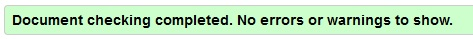

        NOTE: All pages that didn't require login were tested with direct URL and for those that required login the code was that from ```View Page Source```. 

    - #### CSS 
    
        CSS checked was done with [The W3C CSS Validation Service](https://jigsaw.w3.org/css-validator/)
    
        - CSS - base.css
        
            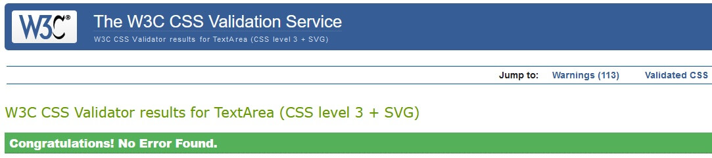

            - The warnings were for:

                The variable is an unknown vendor extension

                The value break-word is deprecated.

                Same color for background-color and border-color on:
                
                - btn-outline-white:focus

                - allauth inputs and buttons

                - custom-checkbox for images on edit products page

                And the rest for unknown vendor extension

                NOTE: Due to a [bug in W3C CSS Validator]( https://github.com/w3c/css-validator/issues/305) the variables has been replaced from inside calc() function as was given 4 errors in the base.css validations

        - CSS - profile.css

            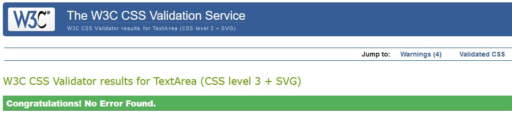

            - The warnings were for:

                All for Unknown vendor extension

        - CSS - checkout.css

            

            - The warnings were for:

                All for Unknown vendor extension
        
    - #### JS 
    
        JS checked was done with [JSHint, a JavaScript Code Quality Tool](https://jshint.com/)
        - base.js

            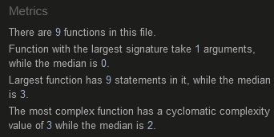

            - One undefined variable:
            
                $ - jquery function.

        - owl.initializer.js

            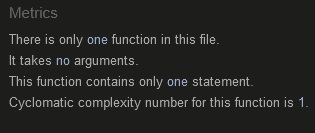

            - One undefined variable:
            
                $ - jquery function.

        - reviews.js

            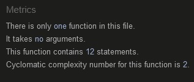

            - One undefined variable:
            
                $ - jquery function.

        - countryfield.js

            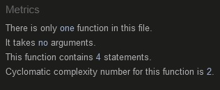

            - One undefined variable:
            
                $ - jquery function.

        - products.js

            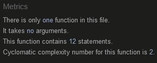

            - One undefined variable:
            
                $ - jquery function.

        - image.widget.js

            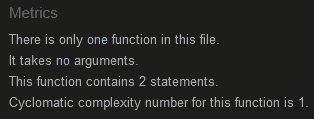

            - One warning:

                - 'template literal syntax' is only available in ES6 (use 'esversion: 6').

            - One undefined variable:
            
                $ - jquery function.

        - quantity_input_script.html

            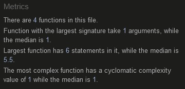

            - Three warnings:

                - 'template literal syntax' is only available in ES6 (use 'esversion: 6').

            - One undefined variable:
            
                $ - jquery function.

        - stripe_elements.js 


            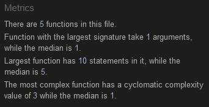

            - Two warnings:

                - 'template literal syntax' is only available in ES6 (use 'esversion: 6').

            - Two undefined variables:
            
                $ - jquery function.

                Stripe - an instance of the Stripe object

        - bag.js

            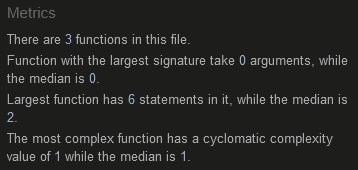

            - One warning:

                - 'template literal syntax' is only available in ES6 (use 'esversion: 6').

            - One undefined variable:
            
                $ - jquery function.

    - #### PEP8 
    
        [PEP8 Validator](http://pep8online.com/) was used to validate Python code

        - All files pass.

            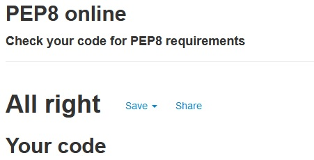


[Back to Top](#table-of-contents)
-----

- ### Lighthouse in Chrome DevTools 

    - Desktop test

        | Pages                                | Performance | Accessibility | Best Practices | SEO |
        | :----------------------------------- | :---------: | :-----------: | :------------: | :-: |
        | Home Page                            |     63      |       93      |        93      |  90 |
        | Products Page                        |     94      |       90      |        93      |  90 |
        | Product Detail Page                  |     88      |       73      |        93      |  90 |
        | Wishlist Page                        |     98      |       89      |        93      |  90 |
        | Review Page                          |     91      |       92      |        93      |  90 |
        | Register Page                        |     98      |       89      |        93      |  90 |
        | Login Page                           |     98      |       89      |        93      |  90 |
        | Profile Page                         |     89      |       78      |        93      |  90 |
        | Product Management Page              |     97      |       81      |        93      |  90 |
        | Edit Product Page                    |     97      |       81      |        93      |  90 |
        | Shopping Bag Page                    |     92      |       80      |        93      |  90 |
        | Checkout Page                        |     81      |       88      |        93      |  90 |
        | Checkout Success Page                |     90      |       89      |        93      |  90 |
        | Contact Page                         |     98      |       92      |        93      |  90 |

    - Mobile test

        | Pages                                | Performance | Accessibility | Best Practices | SEO |
        | :----------------------------------- | :---------: | :-----------: | :------------: | :-: |
        | Home Page                            |     62      |       91      |        93      |  90 |
        | Products Page                        |     73      |       95      |        87      |  89 |
        | Product Detail Page                  |     56      |       70      |        87      |  92 |
        | Wishlist Page                        |     76      |       98      |        87      |  90 |
        | Review Page                          |     77      |       95      |        87      |  92 |
        | Register Page                        |     83      |       95      |        93      |  91 |
        | Login Page                           |     79      |       95      |        93      |  89 |
        | Profile Page                         |     69      |       83      |        93      |  91 |
        | Product Management Page              |     79      |       88      |        93      |  91 |
        | Edit Product Page                    |     79      |       88      |        93      |  92 |
        | Shopping Bag Page                    |     79      |       76      |        87      |  90 |
        | Checkout Page                        |     58      |       96      |        87      |  92 |
        | Checkout Success Page                |     74      |       97      |        93      |  91 |
        | Contact Page                         |     83      |       97      |        93      |  91 |


[Back to Top](#table-of-contents)
-----

- ### Browser compatibility and responsiveness

  - #### Testing on Different Browsers

    - The following web browsers were used for testing the browser compatibility and responsiveness (System: Windows 10 64-bit).

        1. Chrome - Version 92.0.4515.159 (Official Build) (64-bit)

        2. Firefox - 91.0.1 (64-bit)

        3. Edge - Version 92.0.902.78 (Official build) (64-bit)

        4. Opera - Version:78.0.4093.147

        All test was good. 

        Note: No test was performed for Internet Explorer.

  - #### Testing on Different Devices

    1. iPhone 11 - IOS 14.0.1

    2. Ipad Mini 2 - IOS 12.4.8 

    3. Huawei P Smart

    4. iPhone - 10.2.1

  - A large amount of testing was done to ensure that all pages were linked correctly.

[Back to Top](#table-of-contents)
-----

- ### Testing User Stories

    I.	First Time Visitor Goals:

    - To be able to quickly understand the purpose of the website. 

        - Immediately after the home page loads the user quickly understands the purpose of the website from the welcome text, call to action button, and even the hero image 

    - To be able to quickly identify new products and sales.

        - On the home page, there are two carousels one with New Arrival products and one with Now on Sale. Also on the navigation menu on special offers, users can find New arrival or Sale products

    - To be able to know if there is a free delivery

        - Under the navigations menu there is a banner that informs the users about the free delivery

    - To be able to know if there is a free return

        - Under the navigations menu there is a banner that informs the users about the free return

    - To be able to view a specific category of products and use filters inside that category.

        - On the navigation menu, there are many categories from which the user can choose. Once they navigate to a specific category the user can use the ``` sort menu``` the filter the products

    - To be able to view product details and reviews from other customers.

        - Once the user clicks on a product it will be redirected to the product detail page where they can find the product description, and from the tab menu the user can choose to read the product reviews

    - To be able to adjust the product quantity from shopping bag

        - There is implemented functionality so that users can adjust the quantity of each product from the shopping bag

    - To be able to remove a product from a shopping bag

        - There is implemented functionality so that users can remove each product from the shopping bag

    - To be able to receive confirmation after purchase a product.

        - After the user complete the secure checkout successful a confirmation email with user detail and order detail is sent to the email that was used on the complete purchase form

    - To be able to contact the company and subscribe to the newsletter to receive the latest offers

        - On the footer of each page the user can subscribe the our newsletter and can use the link to the contact page for any query

    II.	Returning User Goals:

    - To be able to register for an account and receive confirmations after.

        - The website has the functionality for the user to register for an account and they will receive an email for confirmation. Once they will confirm the email the account will be ready to use.

    - To be able to easy login, logout and easily recover my password

        - The user can login very easy and quickly with no hassle and they can use the ```Forget Password``` link from the login page to reset their password

    - To have a user profile where I keep track of my orders, my query and update personal information

        - Once the user register for an account they will have a profile page from where they can update the personal details, view order history(if any) and view all the queries that they send thru the contact form(if any)

    - To be able to create a wishlist so I can review it later

        - Once the user register for an account they can now add products to their wishlist

    - To be able to leave review for a specific product, and be able to edit or delete the review

    III.	Site Owner Goals:

    - To be able to add, edit and delete products

        - The site owner, once he is login, can add products from the product management page, they can edit each product either by pressing the edit button on the products page or from the product detail page. They also can delete a product from the products page or product detail page once they can confirm the delete.

    - To be able to add, edit and delete categories.

        - The site owner can add, edit or delete categories only from the admin dashboard.

    - Be able to have access to the admin section

        - The site owner will have access to the admin dashboard, but some features will be read-only like the order number, order price, and a few more

    - Have a secure online payment

        - The secure checkout payment is built with Stripe Payments which is a payment processing platform

    - Send confirmation order for each purchase with order and customer details

        - After each purchase a confirmation email it's sent with user and order details
    

[Back to Top](#table-of-contents)
-----

- ### Manual testing

    - Testing all links from the navigation bar

        - Expected: Once each link is pressed it has to redirect to each specific page. Logo to redirect the home page.

        - Result: All links were working correctly.

    - Testing all call to actions links from the ```Home``` page

        - Expected: Each link that is pressed has to redirect to each specific page.

        - Result: All call to actions links are working correctly.

    - Testing product links from each carousel

        - Expected: Each product that is pressed has to redirect to his specific product detail page.

        - Result: As expected the product redirects to his specific product detail page.

    - Testing sort on all products page

        - Expected: The products are to be sorted by each filter accordingly and in the direction that the user has to choose, ascending or descending

        - Result: As expected the sorting filter, either by name, category, brand, or price, and the direction chosen by users are displayed correctly

    - Testing search form

        - Expected: Return all products that contain the query word in: product brand, name, or description 

        - Result: The query result is as expected

    - Testing sort on a search query

        - Expected: Sort the query result without losing the search query

        - Result: The sort is working as expected

    - Testing pagination with sort on a search query

        - Expected: Have the same query search with the sorting filter use the paginations with losing the search query or sort filter

        - Result: The paginations are working as expected without losing any search or sort parameter

    - Testing all links from the breadcrumb

        - Expected: Once each link is pressed from the navigational hierarchy it has to redirect to each specific page

        - Result: All links were working correctly.

    - Testing ``` Keep shopping``` and ``` Add to bag``` buttons from the product detail page

        - Expected 1: The ```Keep shopping``` button should redirect to the products page

        - Expected 2: The ```Add to bag``` button should add the product to the shopping bag

        - Result: As expected the ```Keep shopping``` and ``` Add to bag``` buttons are working correctly.

    - Testing adjust quantity from product detail and shopping bag page

        - Expected: The product quantity should increase/decrease in quantity when the user uses the increase/decrease buttons

        - Result: As expected the increase/decrease buttons on both pages are working correctly.

    - Testing review sections for unregistered users:

        - Expected: The unregistered users can see all the reviews that other users write for a particular product, but then can write any reviews until they sign in. Two links will display the unregistered users: ``` sign in``` or ```sign up```

        - Result: As expected the unregistered users can see only the reviews for the specific product and the two links for ```sign in``` or ```sign up```, the button for writing a review is not display.

        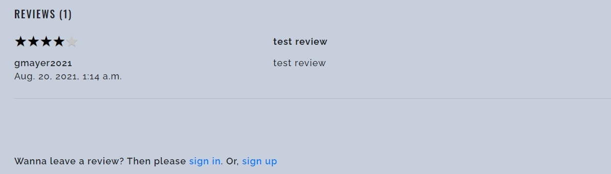

    - Testing wishlist page and wishlist buttons from products page and product detail page for unregistering users:

        - Expected: All buttons for Add to wishlist from the product page and product detail page do not display for unregistering users, and on the wishlist page the two links for ```sign in``` or ```sign up``` will be displayed.

        - Result: As expected the unregistered users can see only the add to wishlist buttons and on the wishlist page the two links for ``` sign in``` or ```sign up``` are displayed.

        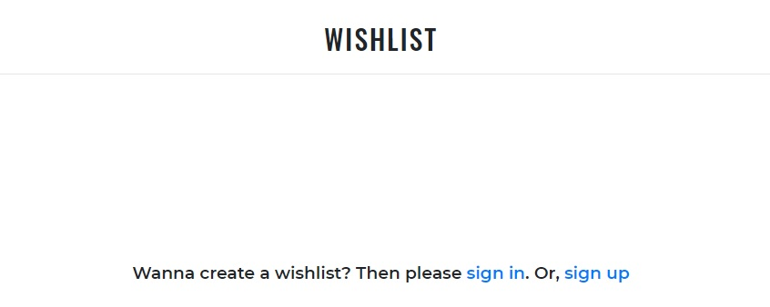

    - Testing update quantity on the shopping bag

        - Expected 1: Once the quantity of product increases/decreases and the update button is pressed the subtotal and total price on the shopping bag should reflect the price base on the new quantity

        - Expected 2: If the user wants to add to the bag a product that already is in the bag the quantity is increasing accordingly

        - Result: As expected the updated quantity on the shopping bag page is working correctly.

    - Testing remove a specific product from the shopping bag

        - Expected: Once the remove button from a specific product is press that product will be removed from the shopping bag

        - Result: As expected when the remove button is press the right product is removed from the bag

    - Testing Complete order for unregistered users

        - Expected: Once the order is complete and it's successful a success message will be shown to the user that an email confirming it's sent to the email address provided on the checkout form.

        - Result: As expected a message will confirm to the user that the order is complete and the email it's sent to the address provided
    
        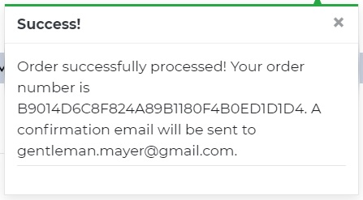
        
        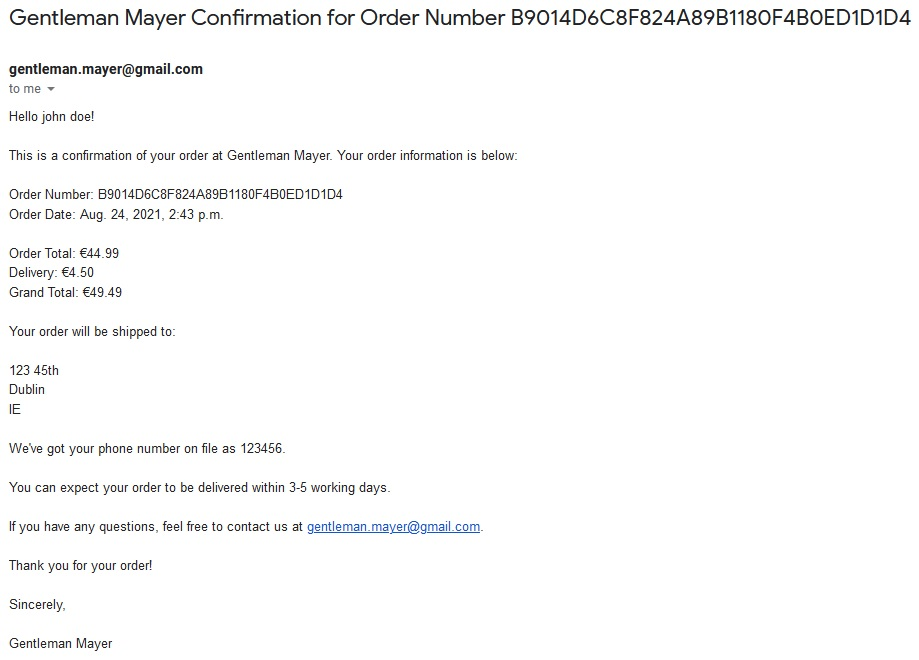

        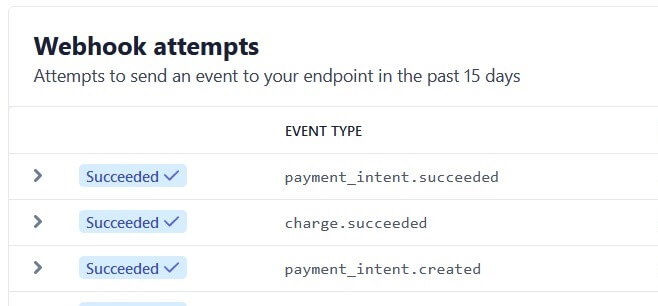

        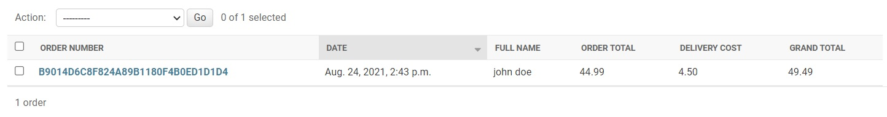
        

    - Testing register to the website

        - Expected: When a user is registered to the website a message with the confirmation that the verification email has been sending to his address will be shown on the screen and an email sent to his address

        - Result: As expected after filling the signup form a message pop up on the screen with the confirmation that the email for verifying has been sent to my address

        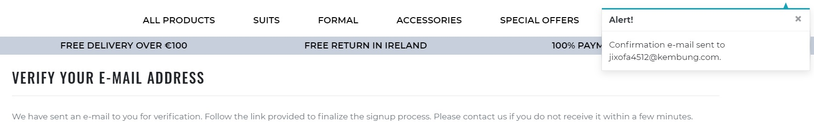

        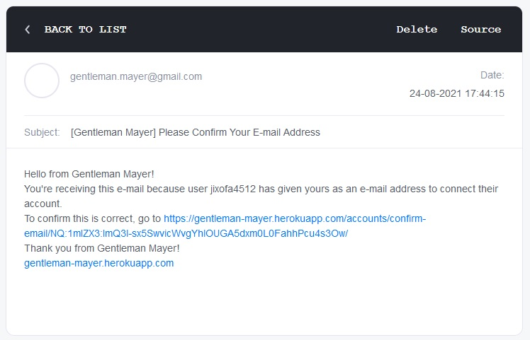
        

    - Testing shows the wishlist buttons

        - Expected: Once the user is sign-in on the products and product detail page show the wishlist button, and the links to sign in and sign up from the wishlist are now hidden and the user can start creating his wishlist

        - Result: As expected after user sign in the button are visible for the user to create his wishlist

        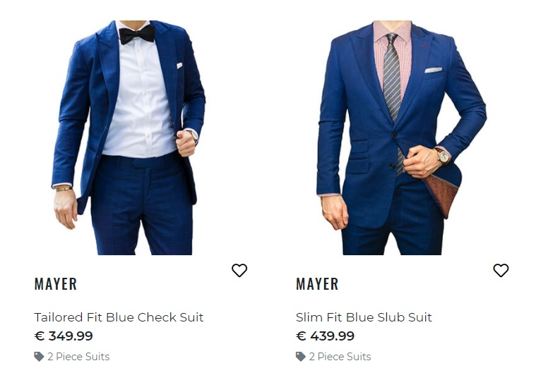
        
        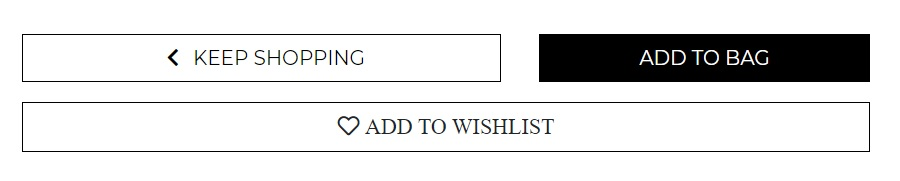

        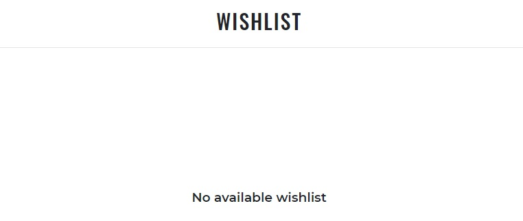

    - Testing adding to wishlist

        - Expected: Once the user adds a product to the wishlist a confirmation message is shown on the screen and the wishlist icon is displaying how many products he has on the list

        - Result: As expected the confirmation message is shown and on the icon is display the numbers of products on his wishlist

        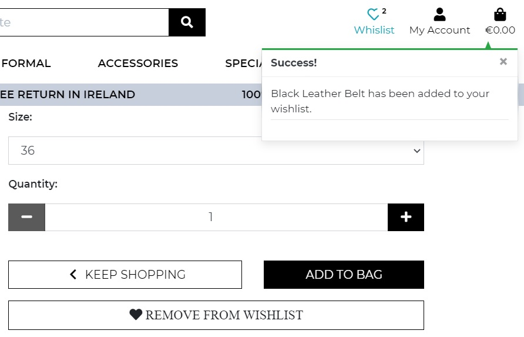

        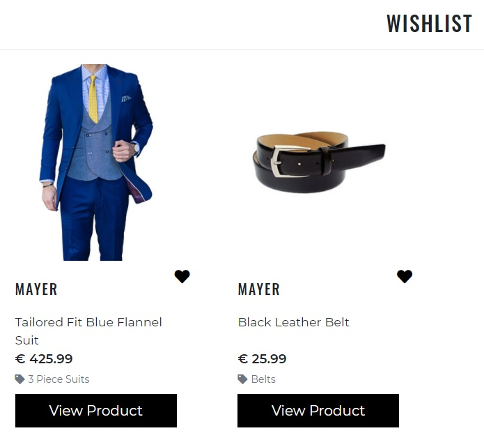

    - Testing removing from wishlist

        - Expected: The user can remove products from wishlist from: products page, product detail, and wishlist page by pressing the wishlist button and on the screen shows a message that the product has been removed

        - Result: As expected the confirmation message is shown that the product has been removed, and the wishlist and display number on the wishlist icon reflects that

        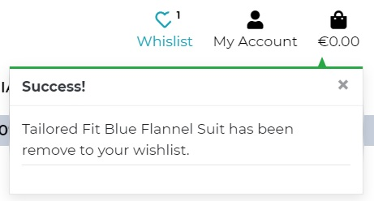


    - Testing order history in a user profile

        - Expected: After the user purchases a product, a confirmation message on the screen is shown, an email is sent and the order is saved on the user profile for his history

        - Result: As expected everything is working correctly messages are been display and emails send and the profile order history is reflecting the purchase order.

        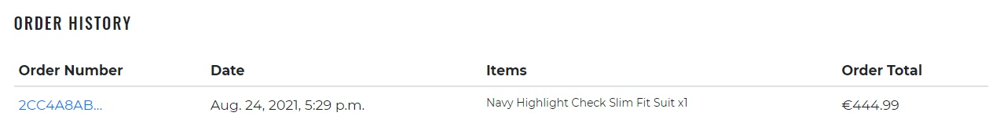

    - Testing link to order detail from the order history

        - Expected: When the user click on the order detail it will redirect to the specific order detail page and a message is displayed that this is a past confirmation

        - Result: Everything is working as expected

    - Testing adding a review for login users

        - Expected: After the user is login he can leave a review for each specific product from the product detail page from the review tab. After a review is submitted a message shows that a review has been added to that product, the user can go back using the back to the product button, and now he can see his review on the tab reviews with the functionality to edit or delete the review.

        - Result: Everything is working as expected

        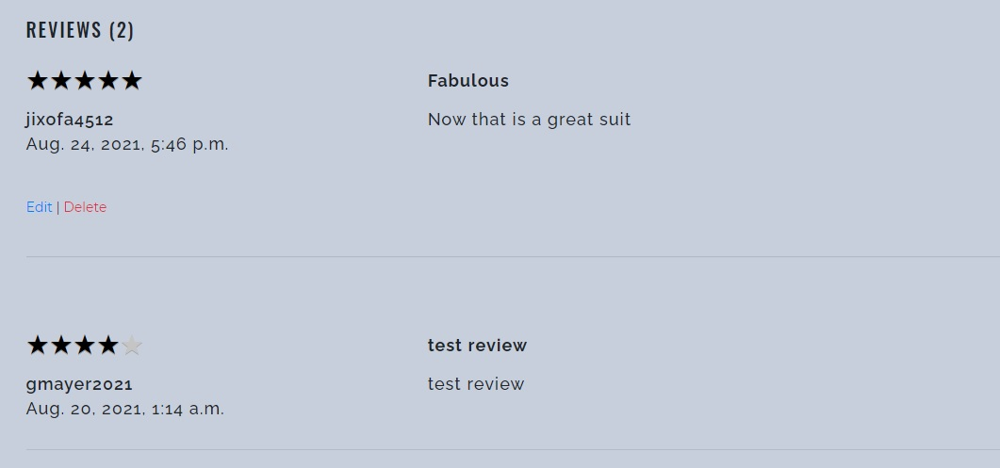

    - Testing editing other users review

        - Expected: When the user is trying to edit other users' reviews an error message is shown on the screen and the request is stopped immediately.

        - Testing: Login on a different browser with the user gmayer2021 and taken the edit link from the first review 

        - Result: After pasting the link into the initial browser an error message is shown on the screen and the request is stopped immediately.

        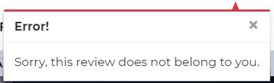


    - Testing deleting other users review

        - Expected: When the user is trying to delete other users' reviews an error message is shown on the screen and the request is stopped immediately.

        - Testing: Login on a different browser with the user gmayer2021 and taken the delete link from the first review 

        - Result: After pasting the link into the initial browser an error message is shown on the screen and the request is stopped immediately.

        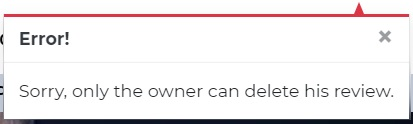

        - Testing user editing his own review

        - Expected: When the user presses the edit link on his review he is redirected to the edit review page and an alert message on the screen that his editing a review is shown. After submitting it successfully the user is redirected back to the product detail page where he can see his review and a confirmation message is shown on the screen also

        - Result: Everything is working as expected

        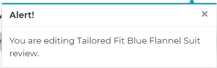

        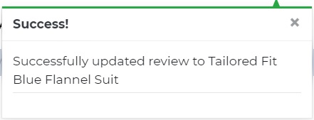


    - Testing user deleting his own review

        - Expected: When the user is trying to delete other users' reviews an error message is shown on the screen and the request is stopped immediately.

        - Testing: Login on a different browser with the user gmayer2021 and taken the delete link from the first review 

        - Result: After pasting the link into the initial browser an error message is shown on the screen and the request is stopped immediately.

        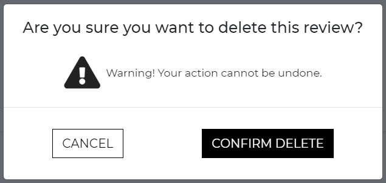

        

    - Testing admin add product

        - Expected: After the admin fills the add product form with all requirements details, the product should appear on the products page, on the search, and on the category the was selected and be able to see the product detail page.

        - Result: As expected the product was uploaded successfully

        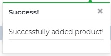

        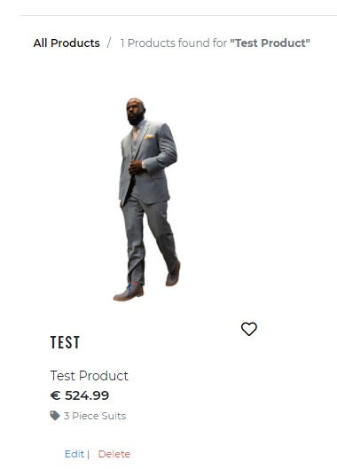

    - Testing admin edit product

        - Expected 1: Change the price of the product to more than 6 digits and click update product. The form should raise an error 

        - Expected 2: Change the price of the product to less than the initial price and update the product. The form should validate

        - Result: As expected in both cases the result is working correctly.

        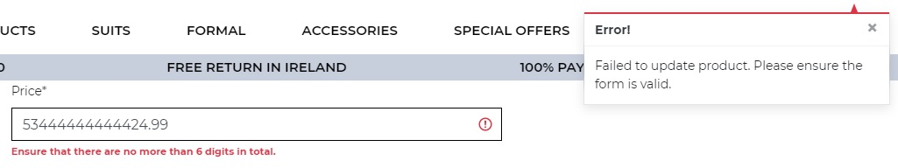

        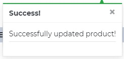

    - Testing admin delete product

        - Expected 1: When the admin wants to delete a product a modal is shown and ask for confirmation before actually deleting the product

        - Expected 2: After the admin confirm the deleted product the product should delete from our database and the page should redirect to the products page

        - Result: As expected in both cases the result is working correctly.

        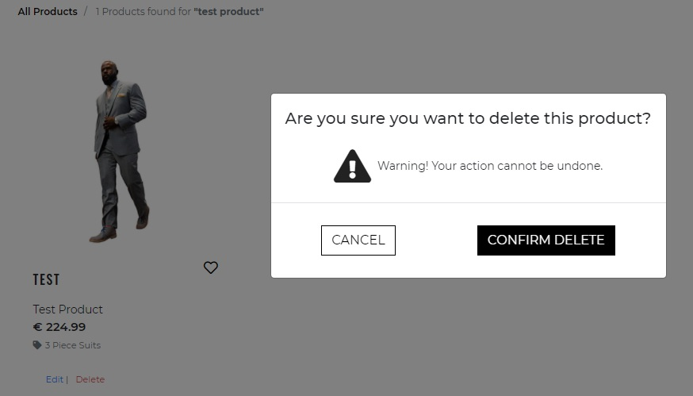

        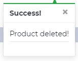

        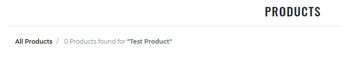

    - Testing stripe payment with [Stripe testing cards](https://stripe.com/docs/testing)

        - Expected 1: First, we choose not to authenticate and the payment should fail

        - Expected 2: Now we authenticate and the payment should not be processed due to insufficient funds

        - Result: As expected the payment failed

        Fail authentication

        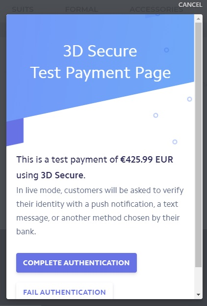

        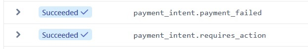

        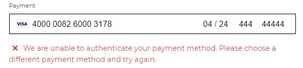

        Complete authentication

        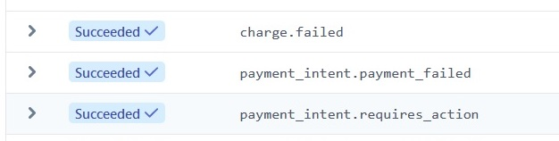

        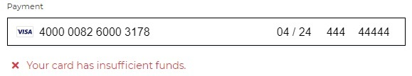


[Back to Top](#table-of-contents)
-----

- ### Bugs and Fixes

    - During the set up of the project for deployment to Heroku after I set up the ```DATABASE_URL``` in ```settings.py``` I got an error on the terminal: 

        ```
        django.db.utils.OperationalError: FATAL:  role "" does not exist on heroku postgres
        ```

        - To fix: After I did a little research on the SLACK Community I found that in the Full Template, from Code Institute, there is a PGHOSTADDR local variable that has been added to accommodate for the new SQLAlchemy lessons. In order to run ```showmigrations``` and migrate after we need to run the terminal this command:

        ```
        unset PGHOSTADDR
        ```

        - After that, I could complete set up the Heroku Postgres

    - After I deploy to Heroku I got an application error from Heroku check your logs

         After I check the logs and see the build I see that the Procfile was not set up correctly and was an error on the Procfile itself: 

        ```
        web: gunicorn gentleman_mayer.wsgi.application
        ```

        - To Fix: It seems that was a typo in Procfile as before application suppose to be ```:``` and not a dot ```.```

        ```
        web: gunicorn gentleman_mayer.wsgi:application
        ```


    - After deploying to Heroku I got an error 400 when opening the application

        - To fix: I set up the Debug to True on the Heroku Config Vars and restart the application. It seems that the error was from the base.js script as it had a trailing slash in front of the path. 

        - After I remove the slash the application was working fine

    - During Development after creating the Contact and Newsletter app after a few tests and set up, when I change the DATABASE_URL for Heroku Postgres to run the migrations with if statement I got an error when trying to run ```showmigrations```:

        ```
        django.core.exceptions.ImproperlyConfigured: settings.DATABASES is improperly configured. Please supply the NAME value.
        ```

        - The site was loading fine on Gitpod with SQLite3 but would start with the DATABASE_URL variable to connect to Heroku.

            - After I did a few research on the SLACK Community it since that if I run 
        
        ```
        echo $DATABASE_URL
        ```
        in the terminal, we get back a response that Gitpod already set the 
        
        ```
        postgresql://gitpod@localhost
        ```

        and was given an error because was not a Postgres URL

        - To fix: run in the terminal

            ```
            unset DATABASE_URL
            ```

    - After set up the Gmail account to send emails I receive two emails at once every time when was doing the test

        - 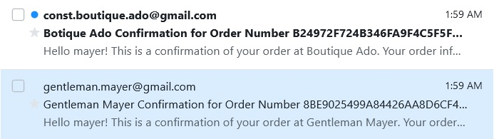

        - It seems that in the Heroku website I had the same variable names in Config Vars on two apps.

        To Fix: I have changed all the variable names from the current project to make sure there is no conflict and after I test send emails again

        As expected I receive only one email from the current project

    - After making few more test on the reviews page I notice that was a flaw in my UX design and the design it breaking apart

        As you can see my initial UX design was not quite fully tested and I was happy with how it looks

        - 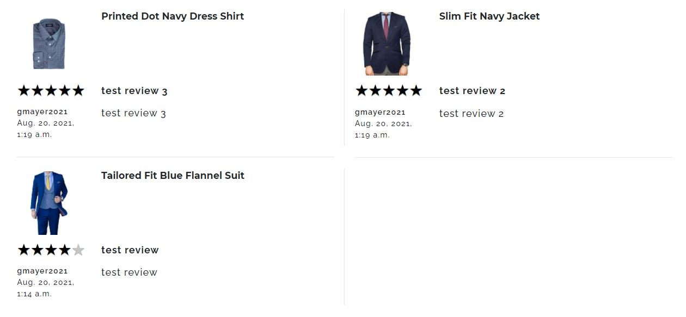

        After the user is log in to the UX design starts to break

        - 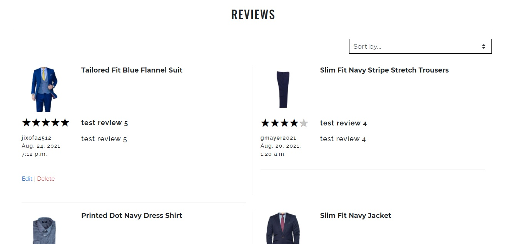

        And if I added a long review to the product it breaks apart

        - 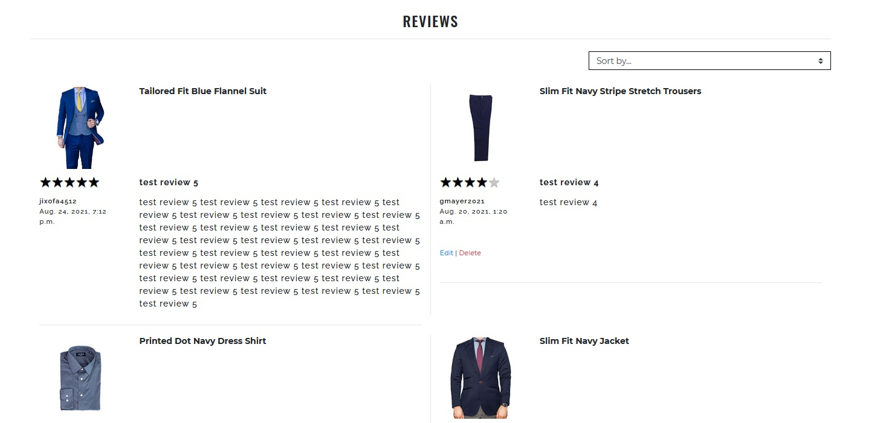

        To Fix: After the main col that was rendered by the for loop I have added another div with display flex so I can make some elements within the column stretch to take the parent full height:

        - First I added:
        ```
        <div class="position-relative d-flex flex-column border-0 rounded-0 h-100">
        ```
        - Second I wrapped the row that holds the description, user, and date into another div:

        ```
        <div class="card-body p-0">
        ```
        - Third I have added to the row that was wrapped by card-body the class h-100

        ```
        <div class="row h-100
        ```
       -  

       NOTE: Basically, it is the same approach that a card has but the reason that I used the ```position-relative d-flex flex-column``` classes instead of the ``` card``` class which basically contains all three plus more, is because of  ```word-wrap: break-word;``` which basically break the stars design, and that was taken from see code credit, and to fix I suppose to add another class with property   ```word-wrap: inherit;``` to override the one on the card, which was too much

    - Stars from the review not showing the correct rating on tablets and phone

        As you can see on the desktop the stars are showing with no flaw whatsoever, but on tablet and phone the design starts to break as the tip of the stars on top and bottom does not show and the color of rating is not showing the correct star rating

        Desktop/laptop

        - 

        Tablet

        - 

        Phone

        - 

        To Fix: I have removed from base.css on the class .star-ratings-css the following

        ```
            height: 25px;
            width: 100px;
            line-height: 0.8;
        ```

        and added instead 

        ```
            width: -webkit-min-content;
            width: -moz-min-content;
            width: min-content;
        ```

        To keep the stars in the same line with the title review I have added ```pt-2``` class to the title review column

        NOTE: To keep the star design clean and match with the site I have remove ```text-shadow: 0px 1px 0 #a2a2a2;``` from .star-ratings-css as well
  
    - After I implemented ```404 page not found``` when I tested the page I got an error in the console every time the page not found occurred

        - 

        To Fix: I have removed from the template base directory the 404 HTML and I have created an ``` error``` app that will hold all the custom error pages.

        After I created the app and test the 404, page not found, I didn't get any errors in the console

    - After checkout out on iphone without filling the checkout form I got an error than was not actually user friendly. That happen because the require atribute does work on old version of IOS.

        - 

        To Fix 1: On the stripe_elements.js I have remove all the billing details except the email address which was required in the ```webhook_handler.py``` when creating the order for the email field.

        To Fix 2: On the the checkout ```views.py``` after checking the if the order form is valid I added on the else statement the folowwing code as was given an error about the intent reference before initiate. 

        ```
        current_bag = bag_contexts(request)
        total = current_bag['grand_total']
        stripe_total = round(total * 100)

        # set secret_key on the stripe
        stripe.api_key = stripe_secret_key

        # create the payment intent
        intent = stripe.PaymentIntent.create(
            amount=stripe_total,
            currency=settings.STRIPE_CURRENCY
        )
        ```
        After I tested the form was working properly and the django message and the form error was display corretly

    
> NOTE: No other bugs that I'm aware of were left unsolved.

Return to [README.md](README.md)